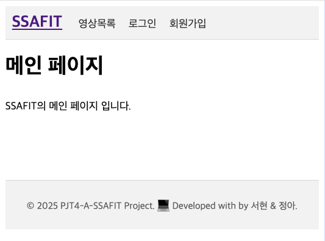

<div align="center">
<h1> 🏋 SSAFIT </h1>
</div>

<b>'SSAFIT'</b> 은 운동 영상 데이터를 기반으로 영상 목록/상세, 리뷰 CRUD, 회원 관리(가입/로그인/마이페이지/수정/탈퇴) 를 제공하는 Servlet/JSP 웹 애플리케이션입니다. <br>

MVC 아키텍처(Controller → Service → Repository)로 계층을 분리하고, JSTL/EL과 공통 header/footer, 공통 CSS를 적용해 기본 UI를 구성했습니다.

<br>
<br>

# 프로젝트 개요
> 프로젝트 이름 : SSAFIT Project - Back
>
> 프로젝트 기간 : 2025.09.26 - 2025.09.28
>
> 팀원 : 이서현, 윤정아

<br>
<br>

# 프로젝트 목표
- Servlet/JSP 기반의 요청/응답 흐름과 Tomcat 배포 이해
- MVC 아키텍처에 따른 계층 분리(Controller/Service/Repository) 및 재사용성/테스트 용이성 확보
- JSTL/EL, 세션, 에러 처리 적용
- 제공 JSON(Youtube 유사 데이터)으로 영상 도메인 CRUD/검색 및 리뷰 기능 구현

<br>
<br>

# 기술 스택
- Backend: Java 11+, Servlet/JSP (Tomcat 10+), JSTL/EL
- Build: Maven (pom.xml)
- View: JSP, JSTL, 간단한 CSS
- Data: JSON 파일 (resources/data/json/…), Gson 파서
- IDE: STS4 / Eclipse
- Server: Apache Tomcat 10+

<br>
<br>

# 프로젝트 구조
```
src/
└─ main/
   ├─ java/
   │  └─ com/ssafy/ssafit/
   │     ├─ controller/    # MVC Controller (Servlet)
   │     └─ model/
   │        ├─ dto/        # VO/Entity
   │        ├─ repository/ # Data access (JSON 로딩/메모리 저장)
   │        └─ service/    # Business Logic
   │
   ├─ resources/
   │  └─ data/json/        # 영상/리뷰 등 JSON 데이터
   │
   └─ webapp/
      ├─ WEB-INF/
      │  ├─ common/        # header.jsp, footer.jsp
      │  ├─ user/          # login.jsp, register.jsp, mypage.jsp, mypageEdit.jsp
      │  ├─ video/         # videos.jsp, videoDetail.jsp, videoForm.jsp ...
      │  └─ review/        # reviewForm.jsp, reviewEdit.jsp
      ├─ css/
      │  └─ common.css     # 공통 스타일
      └─ index.jsp         # 메인

```
<br>
<br>

# 프로젝트 주요 기능
### 회원(User)
- 회원가입, 로그인/로그아웃, 마이페이지(내 정보/저장한 영상), 비밀번호 변경, 회원 탈퇴
- 검증/비즈니스 로직은 Service 계층에서 수행 → Controller는 얇게 유지

### 영상(Video)
- 영상 목록/상세 보기
- JSON 데이터(Gson 파싱) → 메모리에 적재하여 동작

### 리뷰(Review)
- 리뷰 등록/수정/삭제
- 영상 상세에 리뷰 목록 표시 + 리뷰 작성 동선 제공

### 공통 레이아웃
- /WEB-INF/common/header.jsp, /WEB-INF/common/footer.jsp
- /css/common.css 공통 스타일

<br>
<br>

# 프로그램 실행 화면

## 메인 화면 (로그인 전 / 후)
| 로그인 전 | 로그인 후 |
|---|---|
|  |  |

## 영상 목록 / 영상 등록
| 영상 목록 | 영상 등록 |
|---|---|
|  |  |

## 영상 상세 & 리뷰
| 영상 상세 & 리뷰 |  |
|---|---|
|  |  |

## 로그인 / 회원가입
| 로그인 | 회원가입 |
|---|---|
|  |  |

## 마이페이지 / 회원정보 수정
| 마이페이지 | 회원정보 수정 |
|---|---|
|  |  |


<br>
<br>

# 향후 확장 아이디어
- 운동 계획 캘린더/리마인더
- 생성형 AI 기반 영상 추천/운동 코칭
- 서버 재시작에도 데이터 유지 (간단 파일 DB 또는 RDB 연동)
- 인증 강화 (비밀번호 해시, 필터/인터셉터, 권한 체크)